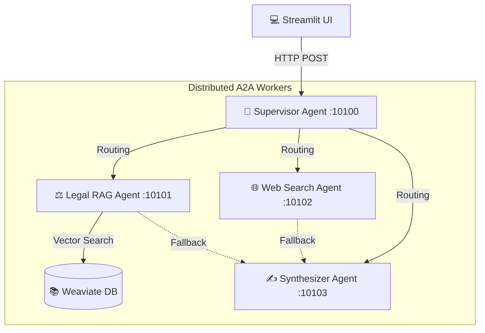

# Lab Assignment Day 09: A2A Supervisor - Workers Architecture

Dự án này là bài tập nâng cấp hệ thống RAG Pipeline (Day 08) lên cấu trúc **Multi-Agent (Supervisor - Workers)** giao tiếp qua giao thức HTTP (A2A Protocol).

---

## Kiến trúc Hệ thống

Hệ thống được thiết kế theo mô hình phân tán, tách biệt từng Agent thành một Microservice độc lập:

1. **Supervisor Agent (Port 10100):** Đóng vai trò làm bộ định tuyến (Router/Orchestrator). Nhận câu hỏi từ Streamlit UI, phân tích ý định (Intent) và gửi yêu cầu (HTTP POST) đến Worker Agent phù hợp nhất.
2. **Legal RAG Agent (Port 10101):** Worker số 1. Chuyên gia luật pháp. Kết nối với Vector DB Weaviate để thực hiện truy vấn RAG về luật phòng chống ma túy.
3. **Web Search Agent (Port 10102):** Worker số 2. Chuyên gia tìm kiếm thông tin bên ngoài. Nhận các câu hỏi về tin tức đời sống và xã hội.
4. **Synthesizer Agent (Port 10103):** Worker số 3. Xử lý các câu chào hỏi giao tiếp thông thường hoặc đóng vai trò fallback khi các hệ thống khác gặp lỗi.



---

## Cấu trúc thư mục

```text
Lab_Assignment/
├── a2a_system/                  # Code của 4 FastAPI Server (Các Agents)
│   ├── supervisor_agent.py
│   ├── legal_rag_agent.py
│   ├── web_search_agent.py
│   └── synthesizer_agent.py
├── group_project/               # Code Giao diện Streamlit & RAG Core
│   ├── app.py
│   └── src/
│       └── module_rag_core/     # Lõi xử lý LLM (Sử dụng OpenRouter)
├── day08_optimize.sh            # Script khởi động 4 Server chạy ngầm
├── .env                         # Chứa API Key (OPENROUTER_API_KEY)
└── README.md
```

---

## Cài đặt & Khởi chạy

### 1. Cài đặt thư viện
Hệ thống sử dụng `uv` để quản lý môi trường. Hãy đảm bảo cài đặt đủ các gói trong `requirements.txt`:
```bash
uv pip install -r requirements.txt
uv pip install fastapi uvicorn requests python-dotenv langchain-openai
```

### 2. Cấu hình môi trường
Đảm bảo đã có file `.env` chứa OpenRouter API Key nằm tại thư mục gốc của `Lab_Assignment`.
```env
OPENROUTER_API_KEY="sk-or-v1-..."
```

### 3. Khởi động Backend Servers (Các Agents)
Mở một terminal (Nên dùng Git Bash hoặc WSL), di chuyển vào thư mục `Lab_Assignment` và chạy:
```bash
bash day08_optimize.sh
```
Hệ thống sẽ chạy ngầm cả 4 cổng mạng: `10100`, `10101`, `10102`, `10103`.

### 4. Khởi động Giao diện người dùng
Giữ nguyên terminal đang chạy server. Mở một **Terminal mới**, di chuyển vào `Lab_Assignment` và chạy:
```bash
uv run streamlit run group_project/app.py
```
Mở trình duyệt ở địa chỉ `http://localhost:8501` để trải nghiệm hệ thống Multi-Agent của bạn!

---

## Cải tiến nổi bật so với Day 08
- Tách rời mã nguồn của Streamlit UI và RAG Engine, giúp hệ thống không bị block.
- Sử dụng mô hình `Supervisor` để phân chia công việc rõ ràng, LLM chỉ tập trung vào một nhiệm vụ chuyên môn duy nhất.
- Hỗ trợ cơ chế **Fallback**: Khi RAG Agent hỏng mạng (lỗi Weaviate / OpenRouter), request sẽ tự động fallback về Synthesizer Agent để phản hồi lỗi thay vì treo toàn bộ Server.
- Cấu hình file `sh` tiện dụng, sử dụng trap signal để tự động cleanup tắt toàn bộ process ngầm khi nhấn `Ctrl + C`.
